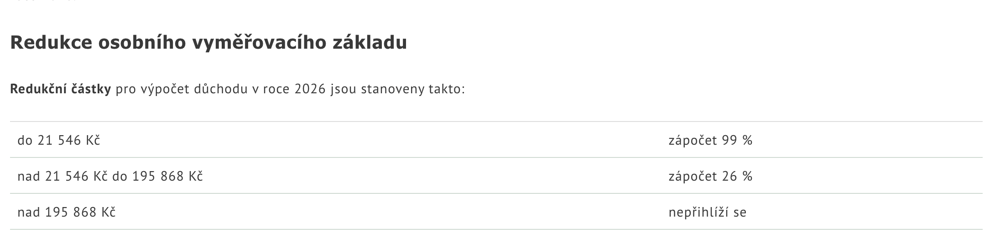
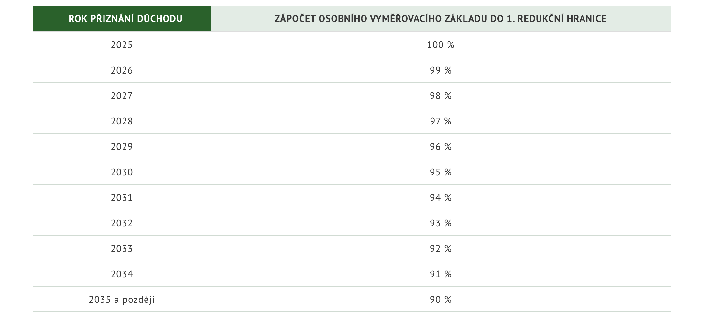
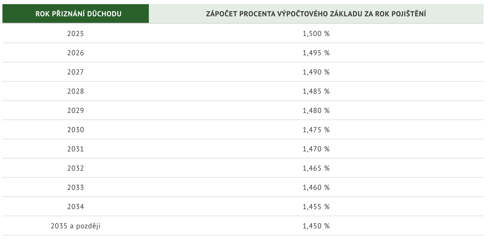

# Legislativa
Zde se nachází vše potřebné pro výpočet starobních důchodů, jež vyplácí ČSSZ - tedy všech s výjimkou vojáků z povolání, policistů, hasičů, příslušníků BIS, Vězeňské
služby ČR a Celní správy ČR.

## Přidat / chybí
- Nároky na přiznání důchodu
- Koeficienty náhradní doby pojištění
- Výpočet základní výměry

## Rovnice pro výpočet důchodu (úvodní)
Pomocí těchto rovnic se spočítá důchod, navyšování důchodu pro stávající důchodce závisí na odlišném mechanismu valorizace důchodů (v závislosti na průměrné mzdě a inflaci).

$$\boxed{\text{celkový důchod} = \text{základní výměra} + \text{procentní výměra}}$$

- Základní výměra je pro každý rok pevná konstanta (10% průměrné mzdy) a zároveň pro všechny důchodce stejná.

$$ \boxed{\text{procentní výměra} = \text{výpočtový základ} \times \text{doba pojištění (roky)} \times \text{procentuální sazba}}$$

- Výpočtový základ
- [Doba pojištění](#doba-pojištění)
- [Procentuální sazba](#procentulní-sazba)

[Výpočet a vyplata důchodu - ČSSZ](https://www.cssz.cz/web/cz/vypocet-a-vyplata-duchodu)

## Redukce osobního vyměřovacího základu
Momentální hranice pro redukci osobního vyměřovacího základu. Částky jsou každoročně přepočítávané konstanty a procenta se mění podle obrázku níže.

První hranice redukce osobního vyměřovacího základu se snižuje v důsledku důchodové reformy (2025), podle obrázku.

[Výpočet a vyplata důchodu - ČSSZ](https://www.cssz.cz/web/cz/vypocet-a-vyplata-duchodu)  
[Důchodová reforma - ČSSZ](https://www.cssz.cz/duchodova-reforma)

## Procentulní sazba

[Důchodová reforma - ČSSZ](https://www.cssz.cz/duchodova-reforma)

## Doba pojištění
zaokrouhuje se na celé roky dolů

### Řádná doba pojištění
= doba, po kterou státu odvádíte pojistné. Patří sem:  
- zaměstnání
- podnikání
- dobrovolná platba sociálního pojištění
- brigády
    - DPP se započítává, přesahuje-li příjem 12 000 Kč měsíčně
    - DPČ se započítává, jestliže příjem přesahuje 4 500 Kč měsíčně

### Náhradní doba pojištění
= doba během které se neodvádí pojistné, ale přesto se započítává do let pojištění pro důchod. Pozor, ne všechny náhradní doby jsou připisovány se stejnám koeficientem (studium 0.8krát x péče o dítě 1krát).

#### SŠ, VŠ a VOŠ studium
- prvních 6 let studia
- před rokem 2010
- od 18 let

#### Doktorské studium
- pouze pro první doktorské studium (prezenční)
- max 4 roky
- od 2009

#### Péče o dítě
- do 4 let věku - vlastní
- do 3 let věku - cizí (+ dohoda s rodiči)

#### Nemoci
- nemoc / karanténa / ošetřovné / mateřská po skončení výdělečné činnosti (?∞)
    - pokud vzniklo během práce nebo v ochranné lhůtě

#### Honorable mention
- manželka prezidenta republiky (∞)

#### Skipped
- pobírači invalidního důchodu a osoby, co by teoreticky mohly, ale nepobírají (∞)
- vojenská služba (asi 10 větví podle typu a doby služby)
    - civilní služba (do 31. 12. 2004)
- pěstounská péče (max 2 roky od prvního příspěvku)
- ochrana svědků (∞)
- úřad práce (až 3 roky)
- osoby se zdravotním postižením v přípravě na zaměstnání (∞)
- péče o závislou osobu
    - do 10 let / jakýkoli věk (dle míry závislosti)
    - podmínka společné domácnosti (výjimka: blízká osoba nebo asistent sociální péče)

[Náhradní doba pojištění - ČSSZ](https://www.cssz.cz/nahradni-doba-pojisteni)

## Potencionálně užitečné odkazy
- [Příručka Důchodce 2026](https://www.cssz.cz/documents/20143/1045831/2026_P%C5%99%C3%ADru%C4%8Dka%20budouc%C3%ADho%20d%C5%AFchodce%20(2026)_web.pdf/fb6f23b0-fdbd-4373-9a01-9d890865cfb9)